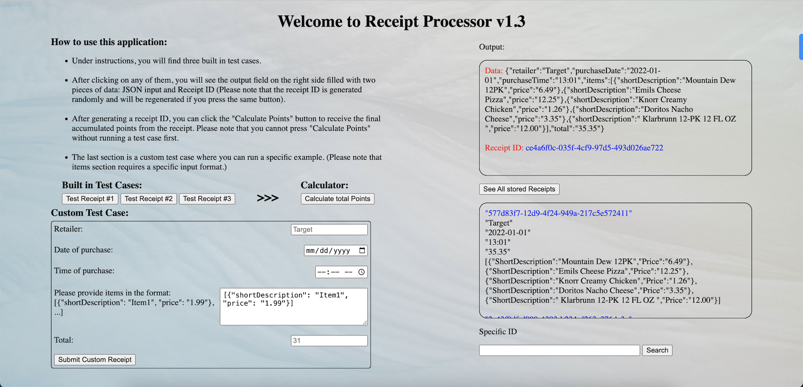

# Welcome to Receipt Processor v1.1 Quick Guide

### This app consists of two parts: the backend (app.go file) and the frontend (static folder)

### While the backend part can be tested and run separately, I created the frontend part for the convenience of testing. It is straightforward, and you can find instructions after running it on localhost

### Assuming you have Go installed on your device, to run the app, please execute the command ``go run app.go `` from the console while in the app directory

### While using the app through the console or Docker, you can access additional information from the backend

### A Docker file is also attached for convenience 
